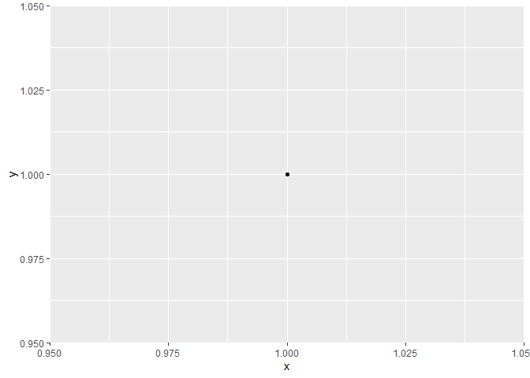

<!-- README.md is generated from README.Rmd. Please edit that file -->

# saver

<!-- badges: start -->
<!-- badges: end -->

The goal of saver is to save output from R, in particular tables and
images, whilst logging key information regarding their production, such
as source file, version of data used and version of any other key
packages used.

## Questions

-   Do we want to think of things as like a “tidy” save?
    -   What would a tidy save be?
        -   Record source file
        -   Date saved
        -   Record version of data used
        -   Record version of any other key packages used
        -   Allow recording of comments to be printed along with the
            object.

## Examples

``` r
library(saver)
library(ggplot2)
```

Save a `ggplot` object efficiently, in the sense that no unused
variables are saved in the environments enclosed by the `ggplot` object.

``` r
# TODO: Add demonstration that this reduces the size and when
plot_fn <- function() ggplot(data.frame(x = 1, y = 1), aes(x,y)) + geom_point()
ggsave_rds(plot_fn,
           'example.rds')
p <- readRDS('example.rds')
p
```



``` r
pryr::object_size(p)
#> Registered S3 method overwritten by 'pryr':
#>   method      from
#>   print.bytes Rcpp
#> 914 kB
```
